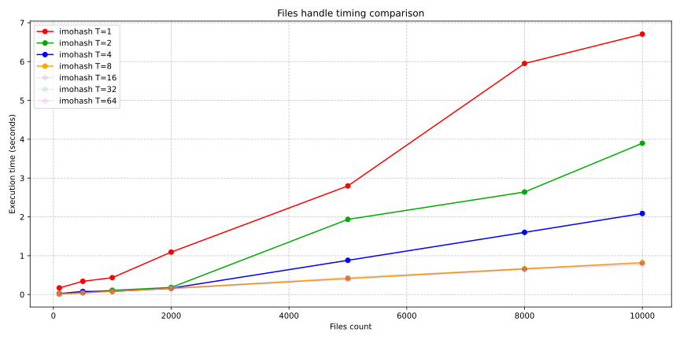
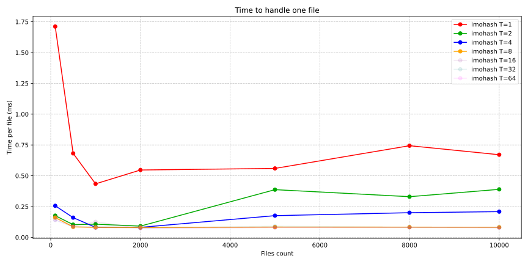

# Benchmark

Performance measure is written in Python using Jupyter Notebook with `matplotlib` and `numpy` libraries.

## Setup

```sh
# initialize python environment
python3 -m venv ./venv

# activate virtual environment
source ./venv/bin/activate

# install dependencies
python3 -m pip install -f requirements-bench.lock

# launch web-application to modify & run file interactively
jupyter notebook ./bench.ipynb
```

## Results

See [bench.ipynb](bench.ipynb) for details:

[](_static/performance_comparison.svg)

[](_static/time_per_operation.svg)

Graphics analyze reveals:

1. optimal number of threads is equals to: `(number of process cores)` OR `(number of process cores) * 2`
2. multithreading increases processing performance up to 8-10x times